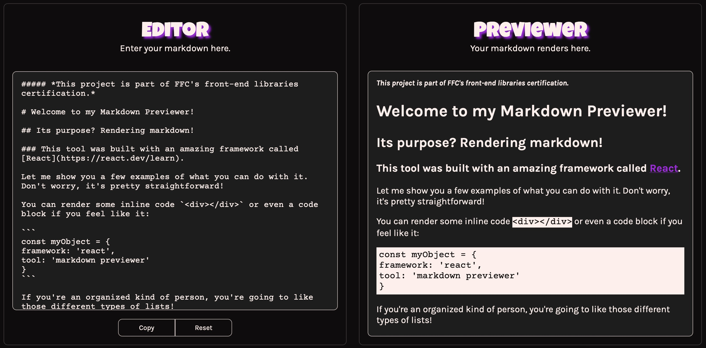
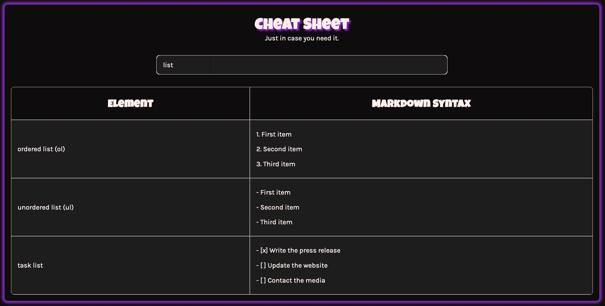
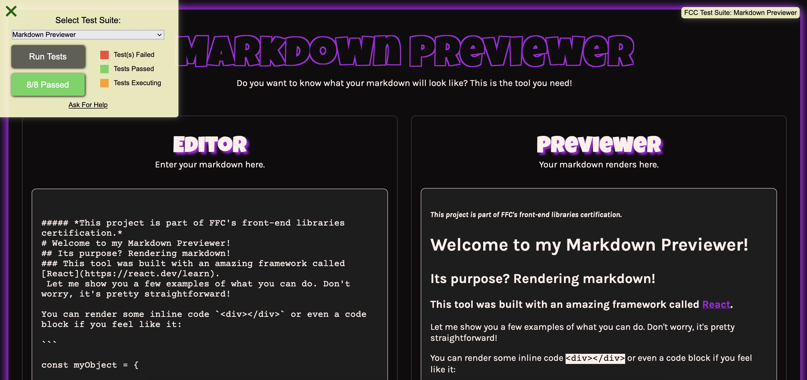

# Front End Development Libraries Project 2 - FreeCodeCamp

This is a responsive markdown previewer. It’s part of the required projects to complete FreeCodeCamp’s Front End Development Libraries certification.

Disclaimer: most of the time, when I try to test my project, only 7 out of 8 tests pass. I tried to downgrade to React 17 to make sure the issue wasn't coming from my code. Indeed, with this previous React version, I didn't have any problem anymore. As stated by FreeCodeCamp, “React 18 has known incompatibilities with the tests for this project (see [issue](https://github.com/freeCodeCamp/freeCodeCamp/issues/45922))”. To conclude, I consider that my project is passing all the tests. 

## Table of contents

- [Overview](#overview)
  - [The challenge](#the-challenge)
  - [Screenshot](#screenshot)
  - [Links](#links)
- [My process](#my-process)
  - [Built with](#built-with)
  - [What I learned](#what-i-learned)
  - [Continued development](#continued-development)
  - [Useful resources](#useful-resources)
- [Author](#author)

## Overview

### The challenge

The goal is to build an app that is functionally similar to the [markdown previewer](https://markdown-previewer.freecodecamp.rocks/) given as example.

The exact requirements:

1. There is a textarea element with a corresponding `id="editor"`.
2. There is an element with a corresponding `id="preview"`.
3. When some text is entered into the `#editor` element, the `#preview` element is updated as I type to display the content of the textarea.
4. When GitHub flavored markdown is entered into the `#editor` element, the text is rendered as HTML in the `#preview` element as I type (HINT: no need to parse Markdown yourself - import the [Marked library](https://cdnjs.com/libraries/marked)).
5. When the markdown previewer first loads, the default text in the `#editor` field should contain valid markdown that represents at least one of each of the following elements: 
- a heading element (H1 size)
- a sub heading element (H2 size)
- a link, inline code, a code block
- a list item
- a blockquote
- an image
- a bolded text
6. When the markdown previewer first loads, the default markdown in the `#editor` field should be rendered as HTML in the `#preview` element.
7. **Optional Bonus** (you do not need to make this test pass): the markdown previewer interprets carriage returns and renders them as ` ` (line break) elements.

### Screenshot

    
    
    

### Links

- Challenge URL: [Challenge URL](https://www.freecodecamp.org/learn/front-end-development-libraries/front-end-development-libraries-projects/build-a-markdown-previewer)
- Live Site URL: [Live site URL](https://leo-code-ca.github.io/markdown-previewer-react)

## My process

### Built with

- React 18
- BEM methodology
- [Marked plugin](https://www.npmjs.com/package/marked?utm_source=cdnjs&utm_medium=cdnjs_link&utm_campaign=cdnjs_library)
- [Dompurify plugin](https://www.npmjs.com/package/dompurify)

### What I learned

One more time, I had a lot of fun while building that project! To be honest, I was expecting it to take me more time (compared to the previous [FCC project](https://github.com/Leo-Code-CA/random-quote-machine) I did). Actually all the process was kind of smooth, and it was really appreciable, even more that lately I've had the feeling to struggle a lot with everything I've been trying to code!

I really tried to focus my energy on the functional part of the app instead of the design. Indeed, I often find myself spending hours on small aesthetic details and even if it can be seen as a good thing, it's also time-consuming, and I'd prefer using that time working on my JavaScript. 

It was the first time I used Markdown parser. I actually used a few plugins before finding the one that worked for me. I first started to look for a React specific parser because I was kind of scared to use the `dangerouslySetInnerHTML` feature. Unfortunately, those plugins weren't providing all the functionalities I needed. I ended going back to the original one, recommended by FreeCodeCamp, Marked and to combine it with a sanitizer to make it safer.

I also downgraded my React version for the first time, because one of the eight FreeCodeCamp tests didn't want to pass with React 18. It was the opportunity for me to learn how to uninstall/ install another version and change the `@testing-library`in the JSON file. 

Finally, I also decided to implement a cheat sheet. It wasn't a requirement, but I thought it would fit well in that context! I really enjoyed building it!

Let's summarize what I've learned:

- Install/ uninstall different React versions
- Use different plugins to parse markdown 
- Use a sanitizer plugin 
- Dynamically render markdown while the user is typing 
- Dynamic search bar without fetch API
- [Think React](https://react.dev/learn/thinking-in-react)

### Continued development

I definitely want to become more experienced with React because I'm liking it a lot! I have the feeling that I still don't have the “React way of thinking” but it still seems less impressive to me than a few weeks ago! The two first chapters of React documentation are absolutely amazing and really helpful, I'm motivated to keep going with the third and the fourth one, which respectively target intermediate and advanced users. 

While working on this project, I also tried to exclusively use my terminal to commit and push to GitHub. I usually use GitHub Desktop, but I'd love to become more comfortable with the command line, so I have to start somewhere! 

### Useful resources

- [GitHub Cheat Sheet](https://training.github.com/downloads/github-git-cheat-sheet/) - very helpful cheat sheet when you're a Git beginner and you don't know all the commands!
- [Copy to clipboard functionnality](https://medium.com/nerd-for-tech/how-to-add-copy-to-clipboard-functionality-in-a-reactjs-app-45404413fdb2) - I sometimes have the feeling some developers look for plugins before trying to know if what they want to do can be done without. This article explains how to easily create a copy to clipboard functionality, without any plugin (even if there are a lot out there!).
- [Downgrade React version](https://dev.to/ifeanyichima/how-to-downgrade-from-react-18-to-1702-818) - this article guides you through the process of uninstalling and installing back another React version (even if it doesn't mention the fact that you also need to update the JSON file).

## Author

- GitHub - [@Leo-Code-CA](https://github.com/Leo-Code-CA)
- FreeCodeCamp - [@Leo-code](https://www.freecodecamp.org/Leo-code)

